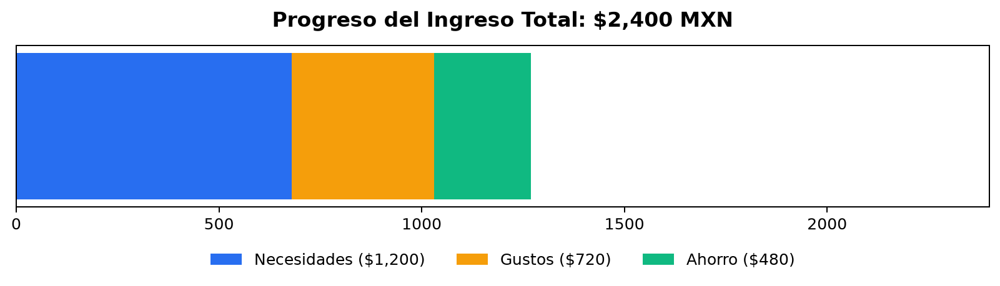

# Cloud Financial Agent

Agente financiero autonomo y self-hosted disenado para registrar, clasificar y monitorear ingresos y gastos bajo la metodologia presupuestal 50/30/20. Utiliza la API de Google Gemini (procesamiento multimodal estructurado), un bot privado de Telegram como interfaz de usuario, ingesta automatizada de correos bancarios via IMAP, almacenamiento local en SQLite y visualizacion en Grafana mediante Docker.

---

## Tabla de Contenidos

- [Caracteristicas Principales](#caracteristicas-principales)
- [Arquitectura y Metodologia](#arquitectura-y-metodologia)
  - [Regla Presupuestal 50/30/20](#regla-presupuestal-503020)
  - [Reglas de Exclusion Antiduplicidad](#reglas-de-exclusion-antiduplicidad)
  - [Blindaje de Seguridad](#blindaje-de-seguridad)
- [Stack Tecnologico](#stack-tecnologico)
- [Estructura del Proyecto](#estructura-del-proyecto)
- [Requisitos Previos](#requisitos-previos)
- [Instalacion y Configuracion](#instalacion-y-configuracion)
  - [1. Clonar el Repositorio](#1-clonar-el-repositorio)
  - [2. Variables de Entorno](#2-variables-de-entorno)
  - [3. Ejecucion Local](#3-ejecucion-local)
- [Despliegue en Homelab / TrueNAS](#despliegue-en-homelab--truenas)
- [Uso del Bot de Telegram](#uso-del-bot-de-telegram)
  - [Canales de Entrada](#canales-de-entrada)
  - [Comandos Disponibles](#comandos-disponibles)
- [Configuracion de Grafana](#configuracion-de-grafana)
  - [Consultas SQL de Ejemplo](#consultas-sql-de-ejemplo)
- [Licencia y Contribuciones](#licencia-y-contribuciones)

---

## Caracteristicas Principales

- **Ingesta Multimodal:** Procesa gastos e ingresos a partir de texto libre, notas de voz (audio OGG/MP3) y fotografias de tickets o recibos de compra.
- **Ingesta Bancaria via IMAP:** Monitorea una bandeja de correo para extraer automaticamente notificaciones bancarias con deduplicacion por identificador unico.
- **Clasificacion Estricta 50/30/20:** Cada movimiento es clasificado exclusivamente en Necesidades, Gustos o Ahorro mediante esquemas estructurados de Pydantic.
- **Deteccion Inteligente de Gastos vs. Ingresos:** Distingue si una transaccion representa una salida o una entrada de dinero para calcular el gasto neto mensual.
- **Regla de Exclusion para Movimientos Internos:** Detecta y omite transferencias entre cuentas propias, pagos a tarjetas de credito (Nu, Mercado Pago) y depositos de sueldo recurrentes para evitar duplicidad.
- **Visualizacion Grafica en Telegram:** Genera un grafico de barra horizontal apilada con los limites presupuestales y el saldo restante por categoria.
- **Privacidad y Aislamiento:** Todo se almacena localmente en SQLite. No se comparten datos financieros con servicios de analitica de terceros.

---

## Arquitectura y Metodologia

### Regla Presupuestal 50/30/20

El sistema implementa de forma nativa la distribucion financiera 50/30/20:

1. **Necesidades (50%):** Gastos basicos indispensables para vivir o trabajar (vivienda, servicios publicos, despensa esencial, salud, educacion y transporte obligatorio).
2. **Gustos (30%):** Gastos de estilo de vida, salidas a comer, entretenimiento, suscripciones de streaming/ocio y compras no esenciales.
3. **Ahorro (20%):** Fondos de emergencia, aportaciones a instrumentos de inversion, retiro o amortizacion de deuda.

### Reglas de Exclusion Antiduplicidad

Para evitar la doble contabilizacion en el presupuesto, el motor de inteligencia artificial aplica la categoria `IGNORAR` a las siguientes operaciones:

- **Pagos a tarjetas de credito:** Liquidaciones o abonos a lineas de credito (ej. pagar la tarjeta Nu desde Mercado Pago). Las compras reales hechas con la tarjeta si se contabilizan; el pago de la tarjeta se omite.
- **Transferencias entre cuentas propias:** Movimientos entre cuentas de debito, ahorros o billeteras digitales del mismo usuario.
- **Ingresos regulares o sueldo:** Depositos semanales o quincenales de salario que fondean el presupuesto base.

Al detectar esta condicion, el bot notifica que el movimiento fue ignorado y no realiza escrituras en la base de datos.

### Blindaje de Seguridad

- **Validacion de Identidad:** El bot rechaza silenciosamente cualquier solicitud proveniente de un `chat_id` distinto al autorizado en la configuracion.
- **Defensas Anti-Prompt Injection:** Las entradas de usuario y los textos de correo se tratan estrictamente como datos crudos no confiables dentro de delimitadores XML (`<texto_analizar>`), impidiendo la ejecucion de instrucciones maliciosas en el modelo de lenguaje.
- **Esquema Tipado Estricto:** Se utiliza Pydantic con literales de tipo para forzar a la API a devolver unicamente formatos JSON validos y deterministas.

---

## Stack Tecnologico

- **Lenguaje:** Python 3.11+
- **Modelo de IA:** Google Gemini API (`google-genai`)
- **Interfaz:** `python-telegram-bot` (modo polling asincrono y job queue)
- **Base de Datos:** SQLite 3
- **Graficacion:** Matplotlib (backend headless `Agg`)
- **Contenedores:** Docker y Docker Compose
- **Analitica Homelab:** Grafana con plugin `frser-sqlite-datasource`

---

## Estructura del Proyecto

```text
cloud_financial_agent/
├── config/                  # Configuraciones adicionales
├── data/                    # Directorio de persistencia de SQLite (gastos.db)
├── locales/                 # Archivos de internacionalizacion (es.json, en.json)
├── src/
│   ├── __init__.py
│   ├── ai_engine.py         # Integracion con Gemini, esquemas y prompts
│   ├── database.py          # Esquema de SQLite, indices y consultas netas
│   ├── i18n.py              # Gestor de traducciones dinamicas
│   ├── mail_parser.py       # Lector IMAP de notificaciones bancarias
│   ├── main.py              # Orquestador y punto de entrada de la aplicacion
│   └── tg_bot.py            # Manejadores de comandos, mensajes y graficos
├── .env.example             # Plantilla de variables de entorno
├── .gitignore               # Exclusion estricta de secretos y bases de datos
├── docker-compose.yml       # Orquestacion del agente y Grafana
├── Dockerfile               # Construccion de la imagen del agente
├── README.md                # Documentacion del proyecto
└── requirements.txt         # Dependencias de Python
```

---

## Requisitos Previos

Antes de iniciar el despliegue, asegurate de contar con:

1. **Token de Bot de Telegram:** Obtenido a traves de [@BotFather](https://t.me/BotFather).
2. **Chat ID de Telegram:** Tu identificador numerico personal, obtenido en [@userinfobot](https://t.me/userinfobot).
3. **API Key de Google Gemini:** Clave gratuita generada en [Google AI Studio](https://aistudio.google.com/).
4. **(Opcional) Credenciales IMAP:** Correo electronico y Contrasena de Aplicacion (si utilizas Gmail) para la ingesta automatica de alertas bancarias.

---

## Instalacion y Configuracion

### 1. Clonar el Repositorio

```bash
git clone https://github.com/jeldrax/cloud_financial_agent.git
cd cloud_financial_agent
```

### 2. Variables de Entorno

Copia la plantilla `.env.example` para crear tu archivo `.env`:

```bash
cp .env.example .env
```

Edita `.env` con tus parametros reales:

```env
# Telegram Bot
TELEGRAM_TOKEN=123456789:ABCDefghIJKLmnOPQRstuvWXYZ
TELEGRAM_CHAT_ID=987654321

# Google Gemini API
GEMINI_API_KEY=AIzaSyD-tu-clave-de-google-ai-studio
GEMINI_MODEL=gemini-3.5-flash

# Ingesta de Correo Bancario (Opcional)
IMAP_USER=tu_correo@gmail.com
IMAP_PASSWORD=tu_contrasena_de_aplicacion
IMAP_SERVER=imap.gmail.com
IMAP_PORT=993
IMAP_FOLDER=Banca_Agente
IMAP_CHECK_INTERVAL_MINUTES=5

# Configuracion Regional
DEFAULT_LANG=es
```

> **Nota:** El archivo `.env` y las bases de datos `*.db` estan listados en `.gitignore` para evitar cualquier exposicion en repositorios publicos.

### 3. Ejecucion Local

Crea y activa un entorno virtual de Python:

```bash
python3 -m venv venv
source venv/bin/activate
pip install -r requirements.txt
```

Inicia el agente:

```bash
python src/main.py
```

---

## Despliegue en Homelab / TrueNAS

El proyecto incluye configuracion lista para ser ejecutada mediante Docker Compose, ideal para TrueNAS SCALE, Unraid o servidores Linux dedicados.

### 1. Despliegue con Docker Compose

```bash
docker compose up -d --build
```

El archivo `docker-compose.yml` inicia dos servicios:
- **hermes_financiero:** Contenedor del agente en ejecucion continua.
- **grafana_homelab:** Instancia de Grafana expuesta en el puerto `3000`, configurada con el plugin de SQLite preinstalado (`frser-sqlite-datasource`) y montaje de datos en modo solo lectura (`:ro`).

### 2. Monitoreo de Logs

```bash
docker compose logs -f agente
```

---

## Uso del Bot de Telegram

### Canales de Entrada

Puedes interactuar con el bot de forma natural utilizando cualquiera de los siguientes formatos:

1. **Mensajes de Texto:**
   - *"Pague 450 pesos del servicio de luz con tarjeta"* -> Registrado como Gasto en Necesidades.
   - *"Compre unos tacos por 120 pesos en efectivo"* -> Registrado como Gasto en Gustos.
   - *"Me devolvieron 200 pesos de una compra en Amazon"* -> Registrado como Ingreso en Gustos.
   - *"Transferi 500 pesos de Mercado Pago a Nu para pagar la tarjeta"* -> Ignorado correctamente.

2. **Notas de Voz:**
   - Envia una nota de voz explicando el movimiento. Gemini transcribira y categorizara el audio directamente.

3. **Fotografias de Tickets o Recibos:**
   - Toma una foto de tu recibo de compra. El modelo analizara la imagen para extraer el comercio, el monto y la categoria.

### Comandos Disponibles

- `/start` - Inicializa la conversacion con el bot.
- `/reporte` - Genera y envia el grafico de barra horizontal apilada con el progreso del mes y el balance neto.
- `/ayuda` - Muestra la guia rapida de comandos.

### Visualizacion del Progreso Presupuestal

Al solicitar el comando `/reporte`, el agente calcula el gasto neto acumulado en el mes (`Gastos - Ingresos`) para cada una de las tres categorias y genera una barra horizontal apilada con los limites presupuestales correspondientes:



Junto a la imagen, el bot envia el desglose textual exacto del saldo disponible:

```text
*Progreso del Ingreso Total ($2,400 MXN)*

*Necesidades ($1,200):*
  - Gasto neto: $680.00
  - Saldo restante: $520.00

*Gustos ($720):*
  - Gasto neto: $350.00
  - Saldo restante: $370.00

*Ahorro ($480):*
  - Gasto neto: $240.00
  - Saldo restante: $240.00

*Saldo restante total disponible:* $1,130.00
```

---

## Configuracion de Grafana

1. Accede a Grafana en `http://<IP_DE_TU_SERVIDOR>:3000` (Usuario: `admin`, Contrasena: `admin`).
2. Dirigete a **Connections** > **Data Sources** > **Add new data source**.
3. Selecciona **SQLite**.
4. En el campo **Path**, ingresa:
   ```text
   /var/lib/grafana/data/gastos.db
   ```
5. Guarda y prueba la conexion con **Save & Test**.

### Consultas SQL de Ejemplo

#### Gasto Neto por Categoria del Mes Actual

```sql
SELECT
    categoria,
    SUM(CASE WHEN tipo = 'Gasto' THEN monto ELSE -monto END) AS gasto_neto
FROM transacciones
WHERE strftime('%Y-%m', fecha) = strftime('%Y-%m', 'now')
GROUP BY categoria;
```

#### Total Gastado en el Mes en Curso

```sql
SELECT
    SUM(CASE WHEN tipo = 'Gasto' THEN monto ELSE -monto END) AS total_mes
FROM transacciones
WHERE strftime('%Y-%m', fecha) = strftime('%Y-%m', 'now');
```

#### Historico Diario de Gastos

```sql
SELECT
    strftime('%Y-%m-%d', fecha) AS dia,
    SUM(monto) AS total_dia
FROM transacciones
WHERE tipo = 'Gasto'
GROUP BY dia
ORDER BY dia ASC;
```

---

## Licencia y Contribuciones

Este proyecto se distribuye bajo la licencia MIT. Las contribuciones, sugerencias y mejoras son bienvenidas. Para participar:

1. Realiza un Fork del repositorio.
2. Crea una rama descriptiva para tu funcionalidad (`git checkout -b feature/nueva-mejora`).
3. Realiza tus confirmaciones (`git commit -m 'feat: descripcion del cambio'`).
4. Publica la rama (`git push origin feature/nueva-mejora`).
5. Abre un Pull Request detallando tus cambios.
